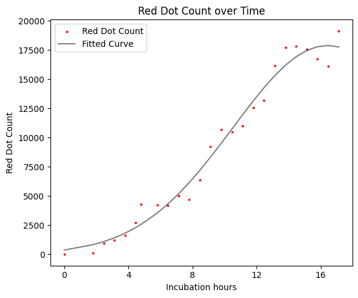

# 세포 이미지에서 붉은 형광 측정하기



## 개요

이 도구는 TIFF 형식의 세포 이미지에서 붉은 형광 점을 자동으로 감지하고 계산하는 Python 스크립트입니다. HSV 색상 공간을 사용하여 붉은색 영역을 식별하고, 시간대별 형광 강도 변화를 추적할 수 있습니다.

## 주요 기능

- **자동 붉은 점 감지**: HSV 색상 공간을 사용한 정확한 붉은색 픽셀 식별
- **배치 처리**: 폴더 내 모든 TIFF 파일을 재귀적으로 처리
- **시간 추적**: 파일명에서 날짜/시간 정보를 추출하여 시계열 분석 지원
- **유연한 출력**: 개별 폴더별 또는 통합 CSV 파일 생성

## 요구사항

```toml
opencv-python>=4.5.0
numpy>=1.20.0
pandas>=1.3.0
click>=8.0.0
```

## 설치

```bash
# 프로젝트 클론
git clone <repository-url>
cd <project-directory>

# 의존성 설치
uv sync
```

## 사용법

### 1. 데이터 준비

세포 이미지를 TIFF 형식으로 저장하고 폴더에 정리합니다.

**파일명 규칙**: `{번호}_{날짜}_{시간}.tiff`
- 예시: `001_20240315_143052.tiff`
- 번호: 실험 번호 또는 샘플 번호
- 날짜: YYYYMMDD 형식
- 시간: HHMMSS 형식

### 2. 형광 측정 실행

```bash
# 기본 사용법 (각 폴더에 개별 CSV 저장)
uv run dot-counter --input data/input/

# 통합 결과 파일로 저장
uv run dot-counter --input data/input/ -o data/output/

# 단축 옵션 사용
uv run dot-counter -i data/input/ -o data/output/
```

### 3. 출력 결과

#### 개별 저장 모드 (기본)
각 TIFF 파일이 있는 폴더에 `red_dot_counts_sorted.csv` 파일이 생성됩니다.

#### 통합 저장 모드 (`-o` 옵션 사용)
지정된 출력 디렉토리에 `count_YYYYMMDD_HHMMSS.csv` 형식으로 저장됩니다.

**CSV 파일 구조**:
```csv
Datetime,Number,Red Dot Count,incubation hour
2024-03-15 14:30:52,1,1250,0.0
2024-03-15 15:30:52,2,1380,1.0
2024-03-15 16:30:52,3,1420,2.0
```

- `Datetime`: 측정 시간
- `Number`: 샘플 번호
- `Red Dot Count`: 감지된 붉은 점의 개수
- `incubation hour`: 시작 시점부터의 경과 시간(시간 단위)

### 4. 데이터 분석

CSV 파일을 사용하여 데이터 분석을 진행합니다.
- `notebooks/` 폴더에 시각화 예제가 포함되어 있습니다.
- 시간에 따른 형광 강도 변화 추이 분석
- 샘플 간 비교 분석

## 명령어 옵션

```bash
uv run dot-counter --help
```

### 필수 옵션
- `-i, --input PATH`: TIFF 파일이 있는 루트 폴더 경로

### 선택 옵션
- `-o, --output PATH`: CSV 파일을 저장할 출력 디렉토리 (선택사항)

## 색상 감지 설정

현재 붉은색 감지는 HSV 색상 공간에서 다음 범위를 사용합니다:

```python
# 붉은색 범위 1 (0-10도)
lower_red1 = [0, 100, 100]
upper_red1 = [10, 255, 255]

# 붉은색 범위 2 (160-180도)
lower_red2 = [160, 100, 100]  
upper_red2 = [180, 255, 255]
```

## 라이선스

MIT 라이선스 하에 배포됩니다.